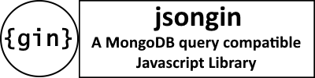

<!-- _coverpage.md -->

# @liquicode/jsongin <small>(v0.1.0)</small>

> A JSON Engine for MongoDB-Style Queries and Data Structure Manipulation

> Filter, Sort, Project, Update, and Aggregate JSON documents anywhere.

> Covers 86.2% (219/254) of the MongoDB API (v6).

	

		
	

	<ul class="cover-feature-list">
		<li>100% pure javascript. No dependencies.</li>
		<li>Faithfully reproduces MongoDB behavior.</li>
		<li>100% parity with MongoDB across 988 behaviors, 219 operators.</li>
		<li>Use extended syntax to define, store, and run a JSON based process.</li>
		<li>Single minified file (~42k compressed) for web deployment.</li>
		<li>All operations are in-memory. This is not a storage library.</li>
	</ul>

[GitHub](https://github.com/liquicode/jsongin)
[NPM](https://www.npmjs.com/package/@liquicode/jsongin)
[Get Started](external/readme.md)

