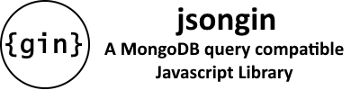

<!-- _coverpage.md -->

# jsongin <small>(v0.0.13)</small>

> A JSON Engine for MongoDB-Style Queries and Data Structure Manipulation

- Accurate compatibility with MongoDB mechanics.
- No external dependencies.
- 100% pure javascript.
- Single minified file (<25k) deployment for web.

[GitHub](https://github.com/liquicode/jsongin)
[NPM](https://www.npmjs.com/package/@liquicode/jsongin)
[Get Started](guides/Library%20Guide.md)

<!-- background image -->
<!--  -->

<!-- background color -->
<!--  -->
<!--  -->
